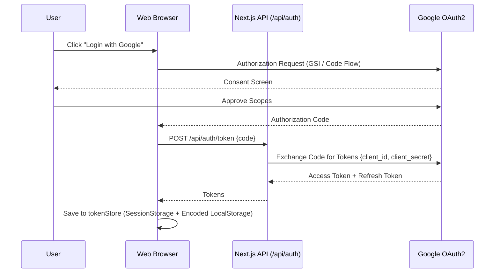

# 🔐 Authentication Flow

Mi Compra App uses **Google OAuth2** for authentication and data persistence authorization. The integration is designed to be secure while providing a seamless "Google Login" experience.

## 🔄 Authentication Sequence

The flow uses the **Google Identity Services (GSI)** client for authorization.

## 📦 Scopes & Permissions

The application requests the following OAuth2 scopes:
-   `https://www.googleapis.com/auth/drive.appdata`: **Drive AppDataFolder**. 
    -   *Why?* To save and sync your shopping lists and expenses in a folder that is private to the app and invisible to the user.
-   `https://www.googleapis.com/auth/userinfo.profile`: **Basic Profile**.
    -   *Why?* To display your name in the application header.

## 🔑 Token Management

-   **Access Token**: Stored in `sessionStorage` (short-lived, tab-scoped). Used for all client-side requests to Google Drive APIs.
-   **Refresh Token**: Stored in `localStorage` with Base64 encoding for basic obfuscation. When a request fails with a `401 Unauthorized` error, the `lib/gdrive.ts` utility automatically calls `/api/auth/refresh` to obtain a new access token without user intervention.
-   **Centralized Storage**: All token operations are handled by `lib/tokenStore.ts` to ensure consistent security across the app.
-   **Server-Side Secrets**: The `GOOGLE_CLIENT_SECRET` is never exposed to the client. Token exchange and refresh happen exclusively on the server side in `app/api/auth/[token|refresh]`.

## 🚪 Protected vs Public Routes

-   **Public Routes**: Any part of the main UI before login. The app shows a landing/auth view (`AuthView.tsx`) if no valid token is found in `localStorage`.
-   **Protected Logic**: All views (`Dashboard`, `Scanner`, `ShoppingList`, `Settings`) are only rendered if `user.loggedIn` is true.
-   **API Protection**: The `/api/analyze` route is functionally internal to the app but relies on environment variables for its own AI keys.
