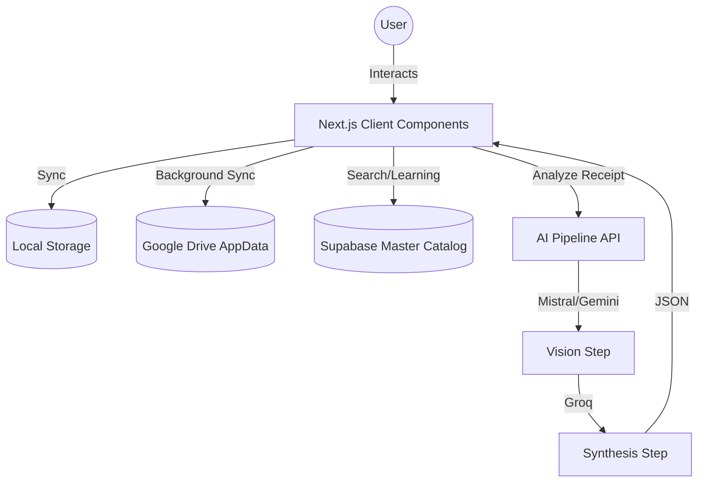

# 🏛️ Architecture

Mi Compra App follows a modern **Offline-First** architecture with a distributed cloud-sync layer and a specialized AI processing pipeline.

## 🧩 Overview

The application is structured as a Single-Page Application (SPA) within the Next.js App Router. It prioritizes local state for an "instant-feel" user experience, typical of high-quality mobile applications, including safe-area support for iOS and hardware back button handling for Android.

## 📡 Data Flow

1.  **Local State (Primary)**: Every user action (adding an item, scanning a receipt) immediately updates the local React state and `localStorage` (`mi_compra_cache_db`).
2.  **Google Drive Sync**: Whenever the state changes and a connection is available, the `updateAndSync` function triggers a debounced (1s) background upload of the entire state as a JSON file (`mi_compra_data.json`) to the user's private Google Drive `AppDataFolder`. Debouncing prevents race conditions during rapid updates.
3.  **Supabase Integration**:
    -   **Product Master**: Used for searching and auto-completing product names.
    -   **Learning Layer**: When a user scans a new product or corrects a name, the app "learns" the association (Alias) and persists it to Supabase for all users.
    -   **Price History**: Tracks price evolution across different stores.

## 🧠 Distributed AI Pipeline

The application processes receipts without local OCR dependencies, which often fail on complex layouts. Instead, it uses a server-side two-step pipeline:

-   **Step 1: Vision (Transcription)**:
    -   Uses **Mistral Pixtral** or **Gemini Pro Vision**.
    -   Multiple images of the same long ticket are processed in parallel using a **Key Rotation** strategy to avoid rate limits.
    -   Result: A literal text transcription of the ticket segments.
-   **Step 2: Synthesis (Structuring)**:
    -   Uses **Groq (Llama 3.3 70B)**.
    -   Combined literals are sent to Groq with a specialized system prompt to extract structured JSON (Store Name, Date, Products, Prices, Total).
    -   Result: A clean, validated JSON object returned to the client for final review.

## 🛡️ Notable Technical Decisions

-   **Offline-First**: Ensures the app works in supermarkets with poor reception.
-   **Hidden Storage**: Using Google Drive `AppDataFolder` keeps user data private and avoids cluttering their main Drive view.
-   **No Local OCR**: Moving vision tasks to the cloud dramatically improves accuracy on low-quality camera captures.
-   **Key Rotation**: Implemented in `app/api/analyze/route.ts` to maximize availability and throughput of free/limited tier AI APIs.
