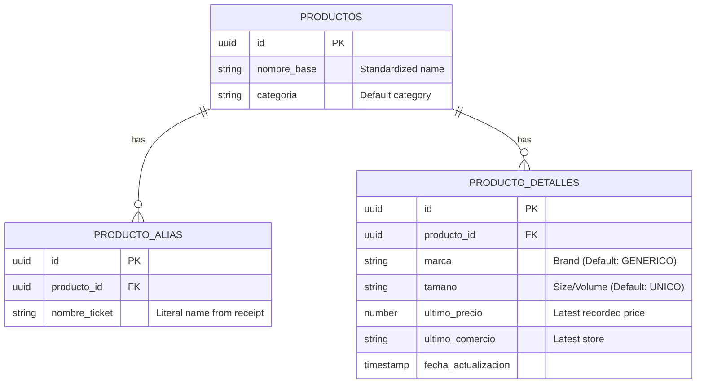

# 🗄️ Database & Storage

Mi Compra App uses a hybrid storage model: **Google Drive** for private user data and **Supabase** for a global shared catalog and price history.

## 💾 Google Drive (User Data)

Individual user data is stored in the **Google Drive AppDataFolder** in a file named `mi_compra_data.json`. This folder is hidden from the user and can only be accessed by the application.

### 📄 Data Schema (`AppDB`)
The JSON file contains the following structure:
-   `gastos`: `Gasto[]` (Historical list of shopping receipts).
-   `lista`: `ListItem[]` (Current shopping list).
-   `customCategories`: `string[]` (User-defined categories).

#### Receipt Model (`Gasto`)
-   `comercio`: Store name.
-   `fecha`: Date of purchase (DD/MM/AAAA).
-   `total`: Number.
-   `category`: Category ID.
-   `photoIds`: Array of Google Drive File IDs for the receipt images.
-   `productos`: Array of items purchased.

## 🐘 Supabase (Master Catalog)

The Supabase instance holds the "intelligence" of the app, shared across all users.

### 🧠 Learning Strategy
1.  **Search**: When a user adds an item, the app searches `PRODUCTOS` (fuzzy matching).
2.  **Alias Matching**: If the AI detects a name like "HUEVOS L30", it checks `PRODUCTO_ALIAS` to map it to "HUEVOS" (standard name).
3.  **Learning**: If no alias is found, the app creates a new entry in `PRODUCTO_ALIAS` after the user confirms the name in the Review Phase.

## 🖼️ Image Storage
Images are uploaded directly to the user's Google Drive `AppDataFolder` using a multi-part upload strategy. They are referenced in the `Gasto` object by their unique Google Drive `fileId`.
